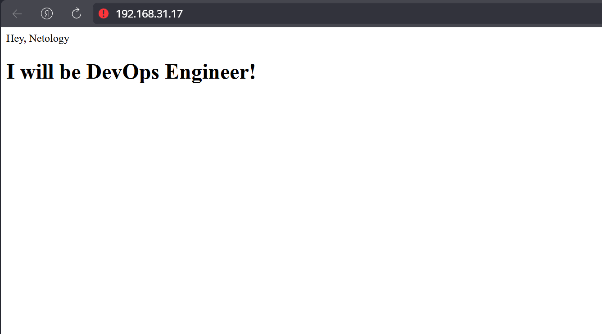
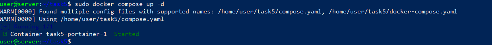

# Задание 1:
Dockerfile\
\
Build\
\
\
Result\
\
# Задание 2:\
\
\
# Задание 3:\
Переименую контейнер в "custom-nginx-t2"\
\
Контейнер остановился, потому как мы подключились к его стандартному выводу и отправили сигнал SIGINT на выключение\
\
\
\
Данное поведение вызвано тем, что порт с которого раннее происходило перенаправление изменился, поэтому port-forwarding ничего не выводит, ведь при запуске мы указывали перенаправление с 80 порта на 8080\
Удалим его не выключая\
\
# Задание 4:\
\
\ 
# Задание 5:\
\
\
\
Или обновим docker-compose до версии 2\
\
Но тогда используется только предпочтительный для v2 docker.yaml\

 
 
 
