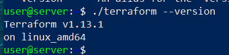
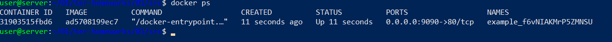
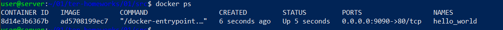
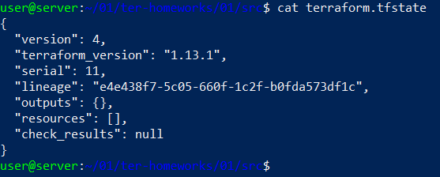
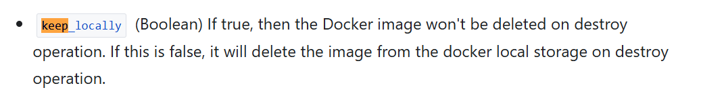

Terraform version

\
Хранить секретные переменные необходимо здесь
personal.auto.tfvars
Инициализируем terraform:
\
Результат создания ресурса “random password”:
"result": "f6vNIAKMrP5ZMNSU"
Ошибки и их исправление:
1.	Должны быть два заголовка – тип и имя
2.	Ошибка в написании имени – должно начинаться с буквы или _
Исправленный код c учётом третьего исправления – ошибка в написании строки к которой обращаются:
terraform {
  required_providers {
    docker = {
      source  = "kreuzwerker/docker"
      version = "~> 3.0.1"
    }
  }
  required_version = ">=1.8.4" /*Многострочный комментарий.
 Требуемая версия terraform */
}
#однострочный комментарий
```json
resource "random_password" "random_string" {
  length      = 16
  special     = false
  min_upper   = 1
  min_lower   = 1
  min_numeric = 1
}
resource "docker_image" "nginx" {
  name         = "nginx:latest"
  keep_locally = true
}
resource "docker_container" "nginx" {
  image = docker_image.nginx.image_id
  name  = "example_${random_password.random_string.result}"
  ports {
    internal = 80
    external = 9090
  }
}
```
Вывод docker ps
\
После смены имени
\
Ключ –auto-approve является аналогом –y и позволяет выполнить код без предварительной проверки, что в некоторых случаях может быть опасно
Удаляем:

\
Образ не был удалён из за строчки keep_locally = true, которая отвечает как раз за то, что image не будет удалён командой destroy
\


